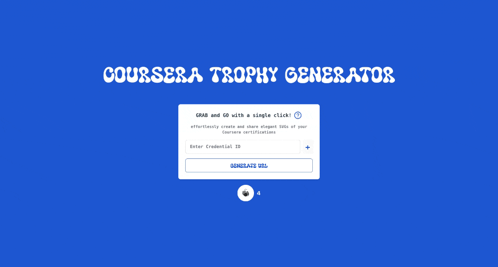
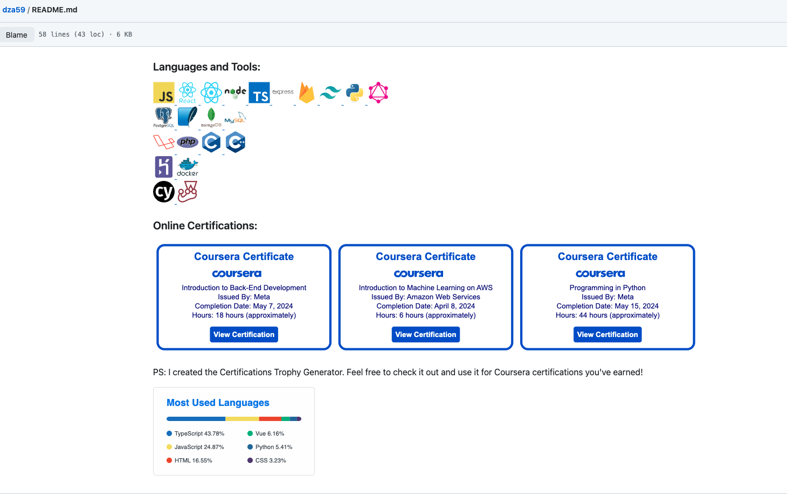

## <a name="introduction">🤖 Introduction</a>

🔗 https://github-coursera-trophy-app.vercel.app

Coursera currently doesn't offer a single link for all certificates, limiting developers from showcasing their continuous learning achievements from one of the most reputable online education platforms.

My tool addresses this by allowing users to input their certification IDs, after which the backend generates a consolidated SVG of all certifications earned. This means you can easily share your achievements anywhere—embed them in a GitHub README or any website using just one link.

📣 This is the beta version. There are many more features to come, which will be rolled out gradually. If you'd like to contribute or have specific feature requests, please contact me via LinkedIn or email. You can find my contact information on my github homepage. Thank you!

❤️ ❤️ This tool is inspired by the [github-profile-trophy](https://github.com/ryo-ma/github-profile-troph), which dynamically generates and displays GitHub Stats Trophies on your README.

## <a name="tech-stack">🗿 Usage</a>



<p>1. Enter your certification IDs into the App generator to create a shareable link for your certificates.</p>


<p>Now you're ready to embed the shareable link on your website.</p>



<p>The above is an example of how I used the link to displays the Certifications Trophy on README</p>

<br>

## <a name="tech-stack">⚙️ Tech Stack</a>


## <a name="quick-start">🤸 Quick Start</a>

Follow these steps to set up the project locally on your machine.

**Cloning the Repository**

```bash
git clone git@github.com:dza59/github-coursera-trophy.git
```

**run Back-End**

```bash
cd api
npm install
nodemon start
```

**run Front-End**

```bash
cd app
npm install
npm run dev
```

<h2 style="text-align: center;">
❤️ ❤️ Thank you for reading! ❤️ ❤️
</h2>
<h5 style="text-align: center;"> Don't forget to like my app on the generator page!
 </h5>
